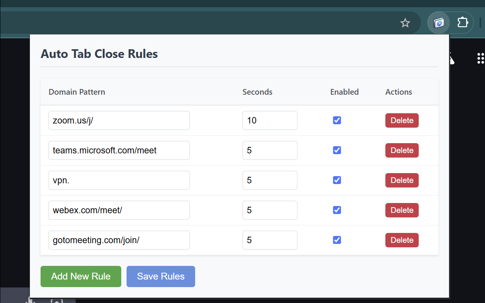
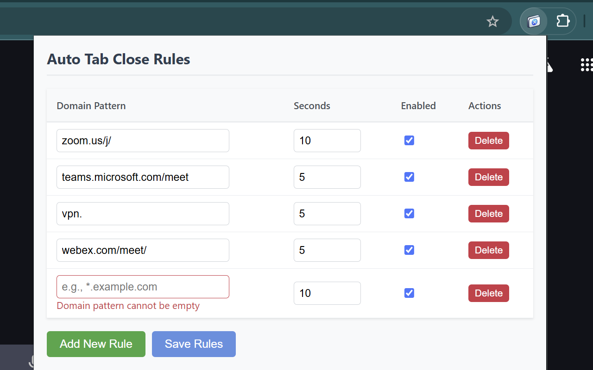

# Auto Tab Close

A Chrome extension that automatically closes tabs based on URL patterns. Perfect for automatically closing tabs from services like Zoom meetings, Teams meetings, VPN authenticators, Slack calls, and other temporary web applications.

## Features

- Automatically closes tabs that match specific URL patterns
- Configurable URL pattern matching
- Great for cleaning up tabs from:
  - Video conferencing (Zoom, Teams, Google Meet)
  - Authentication popups
  - Session validators
  - Temporary web services
- Simple and intuitive user interface
- Minimal resource usage

## Installation

1. Clone this repository
2. Open Chrome and navigate to `chrome://extensions/`
3. Enable "Developer mode"
4. Click "Load unpacked" and select the extension directory

## Screenshots

### Default Extension View

*Main extension interface showing URL pattern management and configuration options*

### Adding New Rules

*Interface for adding new URL patterns with validation feedback*

### Tab Close Confirmation

*Timer popup with close now and cancel options when a matching tab is detected*

## Usage

1. Click the extension icon in your browser toolbar
2. Add URL patterns you want to auto-close (e.g., "zoom.us/postattendee", "*.webex.com/auth/*")
3. The extension will automatically close any new tabs that match these patterns

## Examples

Common URL patterns you might want to add:
- `zoom.us/j/` - Closes Zoom meeting tabs (closes after 5 minutes)
- `teams.microsoft.com/meet` - Closes Microsoft Teams meeting tabs (closes after 5 minutes)
- `vpn.` - Closes VPN authentication tabs (closes after 5 minutes)
- `webex.com/meet/` - Closes Webex meeting tabs (closes after 5 minutes)
- `gotomeeting.com/join/` - Closes GoToMeeting tabs (closes after 5 minutes)

## Contributing

We welcome contributions! Here's how you can help:

1. Fork the repository
2. Create your feature branch (`git checkout -b feature/amazing-feature`)
3. Make your changes
4. Create a Pull Request to the `main` branch with:
   - Clear description of the changes
   - Reference to related issue(s) if applicable
   - Screenshots/GIFs for UI changes
   - Steps to test the changes

### Pull Request Guidelines
- PRs should target the `main` branch
- Include the issue number in PR title (e.g., "[#123] Add new feature")
- Add screenshots or GIFs for visual changes
- Describe what problem your PR solves
- List testing steps you've performed

### Example PR Format
```
Fixes #123

## Description
Added auto-close timing configuration feature

## Screenshots
[Add screenshots/GIFs here]

## Testing Steps
1. Open extension options
2. Configure timing for a URL
3. Verify tab closes after specified time
```

## Privacy Policy

Read our [Privacy Policy](privacy_policy.md) to understand how we handle your data. We take your privacy seriously and do not collect or store any personal information.

## License

[MIT](LICENSE)